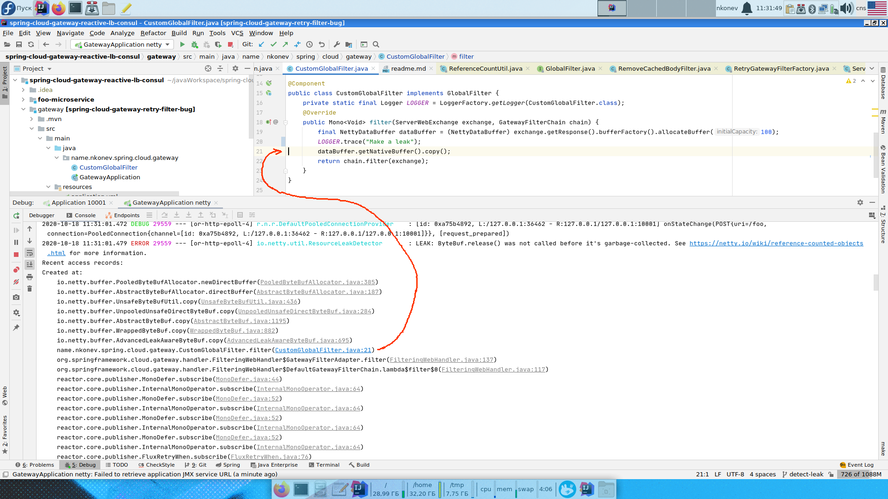

How to detect native memory leak
* You need enforce GC pressure by setting low value of Xmx
* Also set -Dio.netty.leakDetection.level=PARANOID
* Also add `ReactorDebugAgent.init()` at the first line of `main()`
```
-Xms32m
-Xmx32m
-Dio.netty.leakDetection.level=PARANOID
```



