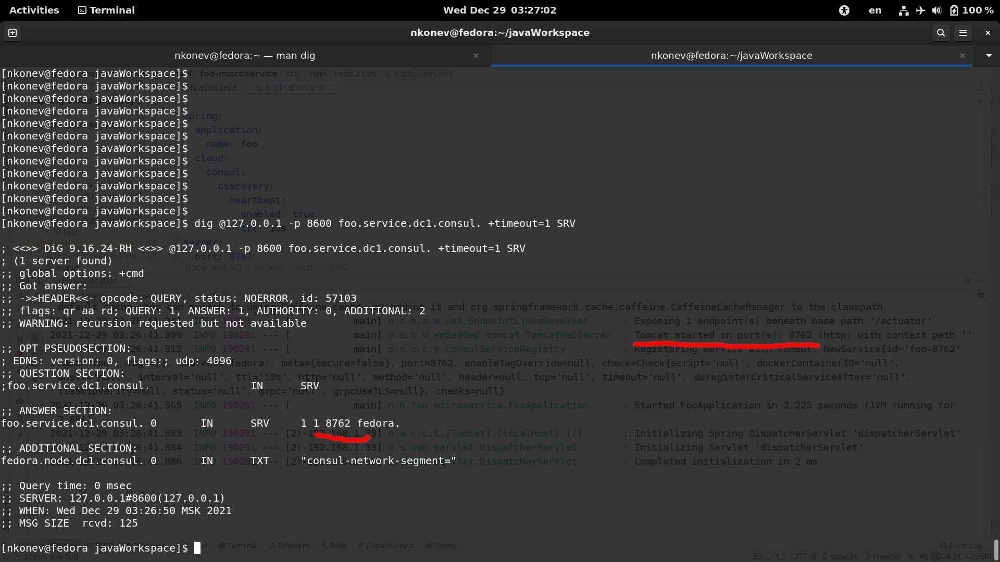

To make your microservices resilient to restart consul you should 
1) set `spring.cloud.consul.discovery.heartbeat.enabled: true` and 
2) run consul v1.7.1 as
```bash
./consul agent -data-dir /var/tmp/consul -advertise 127.0.0.1 -server -bootstrap -ui
```
3) Dig [DNS queries](https://www.consul.io/docs/discovery/dns)
```
dig @127.0.0.1 -p 8600 foo.service.dc1.consul. +timeout=1 SRV
```
Response


# Test
```
curl -i 'http://localhost:8282/foo'
```

# Open consul
http://localhost:8500/ui